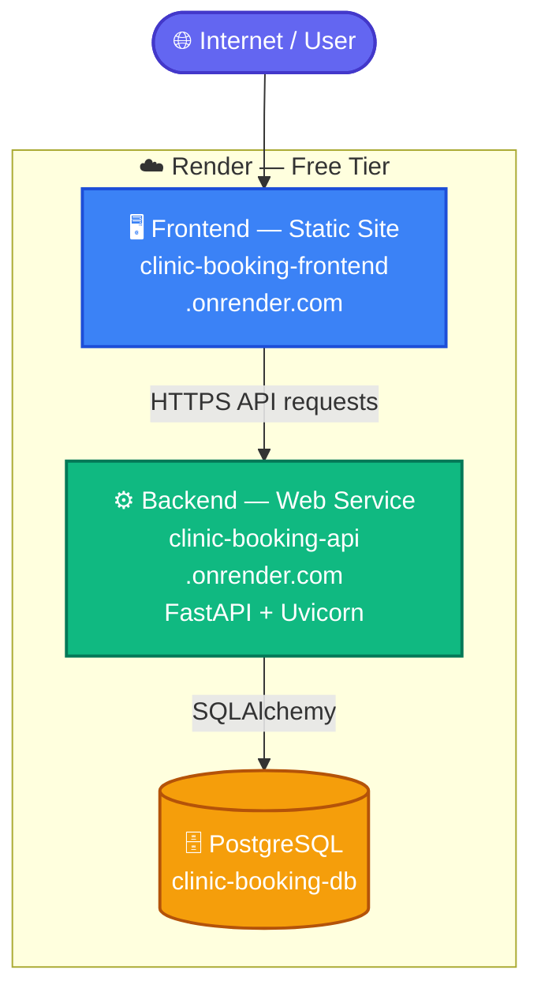
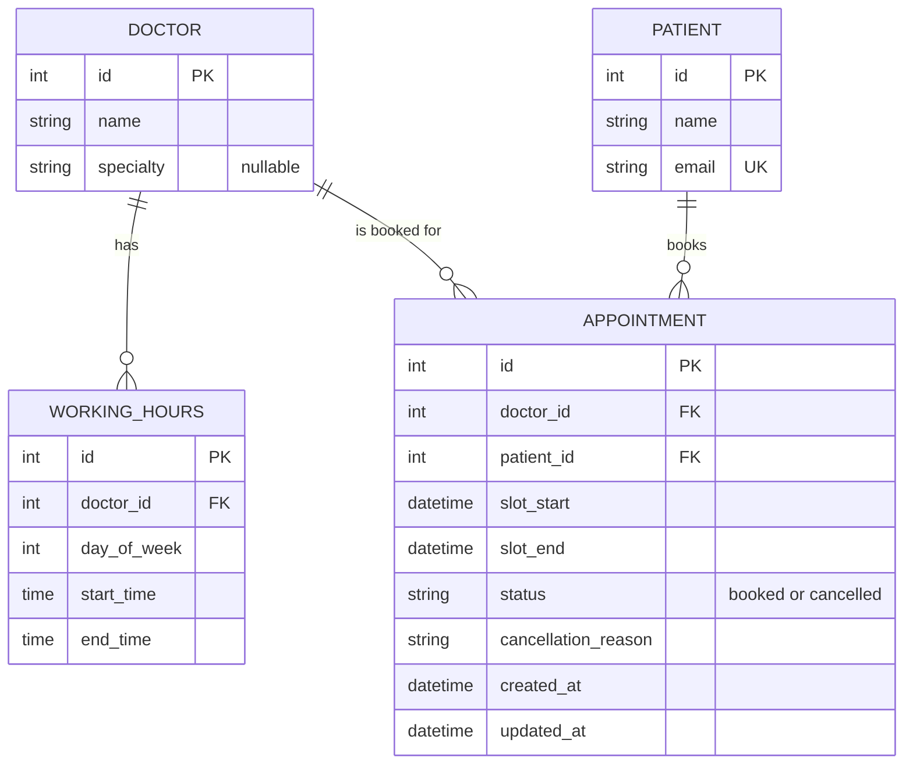
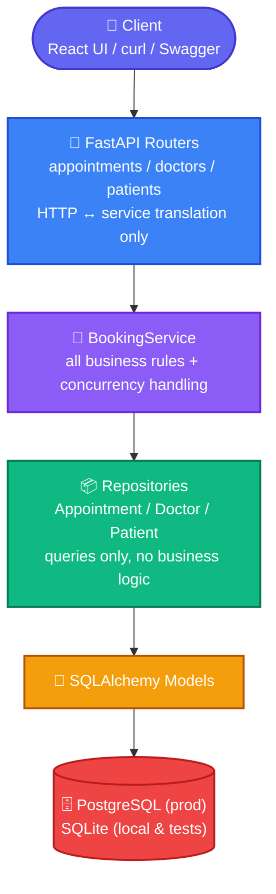

# Clinic Booking System

A REST API (FastAPI + SQLAlchemy) for a small clinic — 5 doctors, 30-minute
slots — plus a React frontend that consumes it. Built for the **Savannah
Informatics backend take-home assessment**.

| | |
|---|---|
| **Public URL (API)** | [`https://clinic-booking-api-9ttn.onrender.com`](https://clinic-booking-api-9ttn.onrender.com) (`/docs` for Swagger, `/health` for liveness) |
| **Public URL (frontend)** | [`https://clinic-booking-frontend-thxz.onrender.com`](https://clinic-booking-frontend-thxz.onrender.com) |
| **Repository** | [https://github.com/cypriankanda/clinic-booking-system](https://github.com/cypriankanda/clinic-booking-system) |
| **Hosting** | [Render](https://render.com) — API, frontend, and PostgreSQL all on Render's free tier |
| **Section 4 reflection** | [`AI_REFLECTION.md`](./AI_REFLECTION.md) |
| **Local + deploy walkthrough** | [`SETUP.md`](./SETUP.md) |

> **Reviewing this live?** Both services are on Render's free tier, which
> spins down after inactivity. **Open the [API URL](https://clinic-booking-api-9ttn.onrender.com/health)
> first** and wait for it to respond (~30-60s on a cold start) — that wakes
> the backend so the frontend's requests succeed instead of timing out.
> Swagger docs are at [`/docs`](https://clinic-booking-api-9ttn.onrender.com/docs)
> on the same API URL.

```
backend/   FastAPI REST API (the assessment deliverable)
src/       React frontend (TanStack Start) — calls the API over HTTP only
```

### Assessment compliance at a glance

| Assessment requirement | Where it's addressed |
|---|---|
| Section 1 — System design, models, trade-offs | [Section 1](#section-1--system-design) below |
| Section 2 — API implementation, all endpoints | [Section 2](#section-2--api-implementation) below |
| Section 3 — Deployment & CI/CD | [Section 3](#section-3--deployment--cicd) below |
| Section 4 — AI reflection | [`AI_REFLECTION.md`](./AI_REFLECTION.md) |
| Bonus: 1-hour minimum notice | [Key decisions](#key-decisions-and-trade-offs) + [endpoint table](#endpoints) |
| Bonus: patient appointment history | `GET /patients/{id}/appointments` in [endpoint table](#endpoints) |
| Bonus: concurrency / double-booking safety | [Key decisions](#key-decisions-and-trade-offs) + `tests/test_concurrency.py` |

---

## Section 1 — System Design



### The scenario, restated

Five doctors, each with fixed weekly working hours, working in 30-minute
slots. Patients view a doctor's free slots for a given day, book one, and that
slot becomes unavailable to everyone else. Patients can cancel and
reschedule. Simple now, but not painted into a corner — the clinic wants to
grow.

### Models



Two constraints matter more than the columns: `WorkingHours` is
`UNIQUE(doctor_id, day_of_week)` — one schedule row per doctor per weekday —
and `Appointment` has a **partial** unique index,
`UNIQUE(doctor_id, slot_start) WHERE status = 'booked'`, which is the actual
double-booking guard (see [Key decisions](#key-decisions-and-trade-offs)).

### Components



Service-layer exceptions (`NotFoundError`, `ValidationFailedError`,
`ConflictError`) are caught by one handler (`app/error_handlers.py`) and
translated into a consistent JSON shape with the right status code:

```json
{ "error": "SLOT_ALREADY_BOOKED", "message": "This slot is already booked" }
```

Every error response follows this `{error, message}` shape regardless of
which layer raised it, so the frontend (and any API client) has exactly one
error-parsing path.

### Key decisions and trade-offs

**Slots are derived, not stored.** There is no pre-generated `Slot` table.
`GET /doctors/{id}/availability` computes the 30-minute grid from
`WorkingHours` at read time and subtracts what's already `booked`. One source
of truth, no background job generating future slots. Trade-off: more
computation per request. At five doctors that's free; at hundreds I'd add a
cached/materialised slots table refreshed on a schedule — but building that
now would solve a problem this clinic doesn't have.

**The double-booking guard lives in the database.** "Once booked, that slot
must not be available to others" is a concurrency problem, not a validation
problem: an application-level `if not booked: book()` has a race window. A
**partial unique index** — `UNIQUE(doctor_id, slot_start) WHERE status='booked'`
— is the actual guarantee. The service still does an optimistic pre-check for
a fast, friendly `409`, but the loser of a real race is rejected by the DB
with an `IntegrityError` that the service turns into a clean `409`. This holds
across multiple app instances behind a load balancer. See
`app/services/booking_service.py` and `tests/test_concurrency.py`, which races
two real threads for the same slot and asserts exactly one wins.

**Reschedule updates the same row rather than cancel+recreate.** Changing
`slot_start`/`slot_end` in a single `UPDATE` makes "free the old slot, claim
the new one" atomic by construction — no window where both slots are briefly
free or briefly double-claimed — and the same index still guards the new
slot.

**Cancelled appointments don't block rebooking.** Because the index is
partial, a cancelled row leaves nothing blocking that doctor/slot pair — the
slot is immediately bookable again.

**All datetimes are UTC**, converted at the API boundary. Clients send
timezone-aware ISO 8601; validation, slot math and storage are all UTC. A
custom `UTCDateTime` type (`app/core/types.py`) normalises to naive UTC on
write and re-attaches `tzinfo=UTC` on read, because SQLite silently drops
timezone info even on a `DateTime(timezone=True)` column — which had made a
freshly booked slot fail to equality-match the datetime availability was
excluding. Behaviour is now identical on SQLite (dev/tests) and Postgres
(prod).

**The 1-hour minimum notice (bonus) applies to bookings and reschedules**, and
is reflected in `GET availability` — a slot 20 minutes from now isn't listed,
since booking it would be rejected anyway. Showing it and then refusing would
be dishonest to the client.

### Ambiguities I decided and am noting here

- "Within working hours" includes the start time and requires the full
  30-minute slot to end at or before closing (a slot starting 5 minutes
  before close is rejected, not truncated).
- A doctor with no `WorkingHours` row for a weekday is treated as not working
  that day (empty availability, booking rejected) rather than a configuration
  error — the common real-world case is simply "doesn't work weekends".
- `slot_start` must align exactly to the 30-minute grid relative to midnight
  UTC; `09:15` is a validation error, not silently rounded.
- Cancellation requires a non-empty reason (1–500 chars), per "cancel with a
  reason".
- A patient may hold appointments with different doctors in the same slot;
  the uniqueness rule the scenario states is per doctor.

---

## Section 2 — API Implementation

### Endpoints

| Method | Path | Description | Codes |
|---|---|---|---|
| `POST` | `/appointments` | Book a slot — validated against working hours, past times, 30-min grid, 1-hour notice, and existing bookings | 201 / 400 / 404 / 409 / 422 |
| `GET` | `/doctors/{id}/availability?date=YYYY-MM-DD` | Free 30-minute slots for a doctor on a date | 200 / 400 / 404 |
| `PATCH` | `/appointments/{id}/cancel` | Cancel with a reason; slot becomes bookable again; errors if already cancelled | 200 / 404 / 409 / 422 |
| `PATCH` | `/appointments/{id}/reschedule` | Move to a new slot, fully re-validated; old slot freed; errors if cancelled | 200 / 400 / 404 / 409 / 422 |
| `GET` | `/patients/{id}/appointments` | **Bonus** — upcoming appointments sorted by date | 200 / 404 |
| `GET` | `/doctors`, `/patients` | Read-only lists (the frontend needs IDs) | 200 |
| `GET` | `/health` | Liveness check | 200 |

Full request/response schemas are in Swagger at `/docs` once running — kept
out of this README to avoid the two drifting out of sync.

### Error handling strategy

All four mutating/validating endpoints share one exception-to-HTTP mapping
(see [Section 1](#section-1--system-design)):

| Service exception | HTTP status | Example `error` code |
|---|---|---|
| `NotFoundError` | 404 | `DOCTOR_NOT_FOUND`, `APPOINTMENT_NOT_FOUND` |
| `ValidationFailedError` | 400 / 422 | `OUTSIDE_WORKING_HOURS`, `OFF_GRID_SLOT`, `NOTICE_TOO_SHORT` |
| `ConflictError` | 409 | `SLOT_ALREADY_BOOKED`, `ALREADY_CANCELLED` |

422 is reserved for request-shape validation (Pydantic); 400 is used for
business-rule validation that depends on doctor/schedule state.

### Running locally

Full step-by-step (installs, Alembic, DB inspection, frontend, Render) is in
[`SETUP.md`](./SETUP.md). The short version:

```bash
# Backend — Docker + Postgres (matches production)
cd backend && docker compose up --build     # API on http://localhost:8000

# Backend — plain Python + SQLite (zero services)
cd backend
python -m venv venv && source venv/bin/activate
pip install -r requirements.txt
alembic upgrade head          # or just start the API; create_all runs on boot
python seed.py                # 5 doctors Mon–Fri 09:00–17:00 UTC, 2 patients
uvicorn app.main:app --reload --port 8000

# Frontend (repo root, separate terminal)
bun install && cp .env.example .env && bun run dev   # http://localhost:8080
```

### Tests

```bash
cd backend && pytest -q && ruff check app tests
```

19 tests: booking validation (past, off-grid, outside working hours, unknown
doctor/patient, notice window), cancel/reschedule state transitions,
rebooking a cancelled slot, the bonus patient list, and a genuine
multi-threaded double-booking race (`tests/test_concurrency.py`).

---

## Section 3 — Deployment & CI/CD

**Public URL:** [`https://clinic-booking-api-9ttn.onrender.com`](https://clinic-booking-api-9ttn.onrender.com) —
[`/health`](https://clinic-booking-api-9ttn.onrender.com/health) and
[`/docs`](https://clinic-booking-api-9ttn.onrender.com/docs) both answer.
Frontend is live at
[`https://clinic-booking-frontend-thxz.onrender.com`](https://clinic-booking-frontend-thxz.onrender.com).
Free-tier services sleep after inactivity — hit the API URL first to wake it
before testing the frontend.

**Provider:** Render, chosen for its free tier covering a web service, a
static/web frontend, and managed PostgreSQL in one dashboard, with zero-config
HTTPS on the `.onrender.com` domain.

**Branch that triggers deployment:** `main`. The `deploy` job in
[`.github/workflows/ci-cd.yml`](./.github/workflows/ci-cd.yml) is gated on
`github.event_name == 'push' && github.ref == 'refs/heads/main'`, so it runs
only when a PR is merged — never on the PR itself — and only after the test
job passes.

**What the pipeline does:**

1. **Every pull request against `main`:** installs backend dependencies,
   lints with `ruff`, runs the full `pytest` suite, and builds the frontend.
2. **On merge to `main`:** re-runs those checks, then POSTs to Render's deploy
   hook (`DEPLOY_HOOK_URL` secret) for the `clinic-booking-api` service —
   Render then pulls the new commit, rebuilds, and redeploys. Keeping the
   deploy behind a hook rather than provider-specific Actions steps means no
   Render credentials or service IDs live in this repo, only the one secret
   URL.
3. **Migrations:** Render runs `alembic upgrade head` as the service's release
   command before the new instance takes traffic, so a bad migration blocks
   the deploy instead of shipping half-migrated.

**Frontend deploys separately:** `clinic-booking-frontend` is its own Render
static site, connected directly to the repo with its own auto-deploy on
`main` — it doesn't go through the API's deploy hook, since the two have
independent build steps (`VITE_API_URL` is baked in at the frontend's build
time, pointed at the API URL above).

**Secrets & environment:** `DATABASE_URL` and `ALLOWED_ORIGINS` are read from
the environment (`app/core/config.py`) and never committed. Locally
`DATABASE_URL` defaults to a SQLite file so the project runs with zero setup.
The frontend reads `VITE_API_URL` at build time.

**Rollback:** Render keeps prior deploys per service, so a bad deploy can be
rolled back instantly from the Render dashboard without touching git. The
git-native path also works: reverting the merge commit on `main` triggers the
same pipeline and redeploys the previous state.

---

## Section 4 — AI Reflection

See [`AI_REFLECTION.md`](./AI_REFLECTION.md).

---

## Frontend (not required by the assessment)

A React + TanStack Query UI at `/` that exercises every endpoint: doctor /
patient / date pickers, a live availability grid, booking,
cancel-with-reason, and reschedule. Times render in UTC to match the API
contract exactly, and error toasts reuse the API's own `error` code and
`message` rather than inventing wording. It talks to the API purely over
HTTP — no shared code or database.